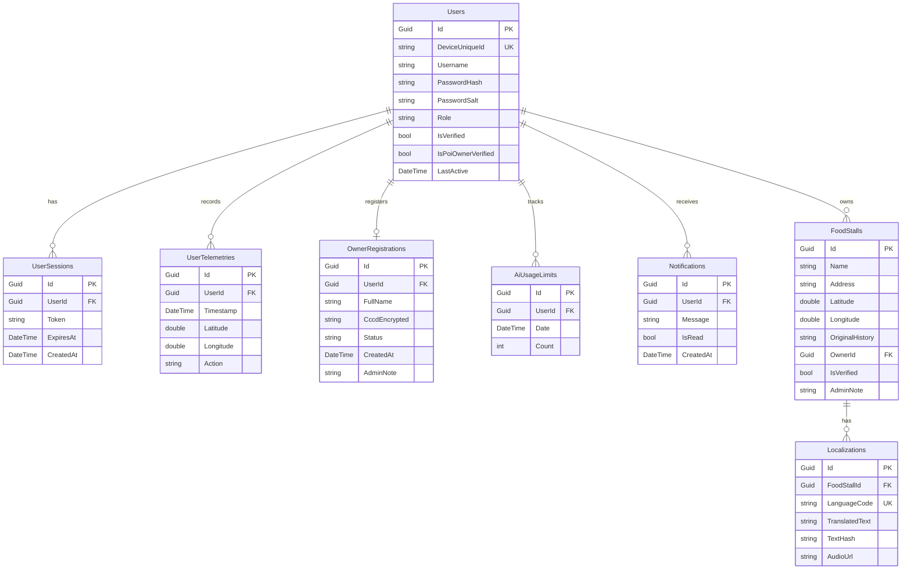
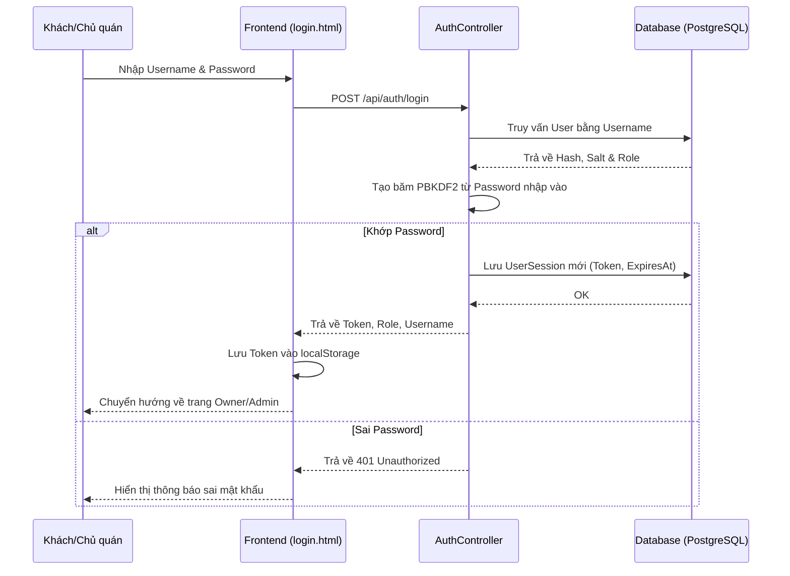
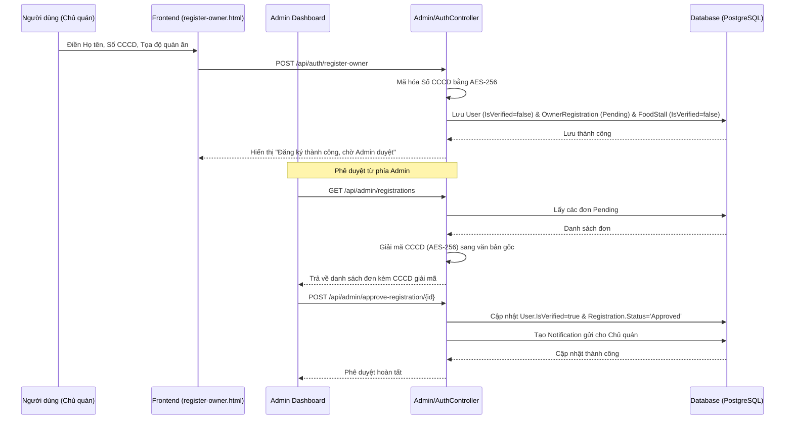
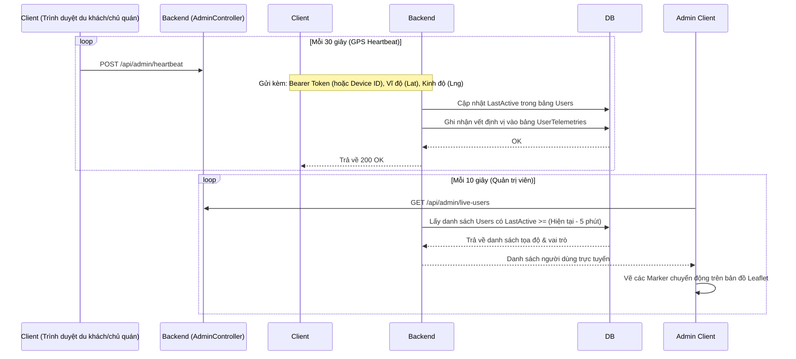
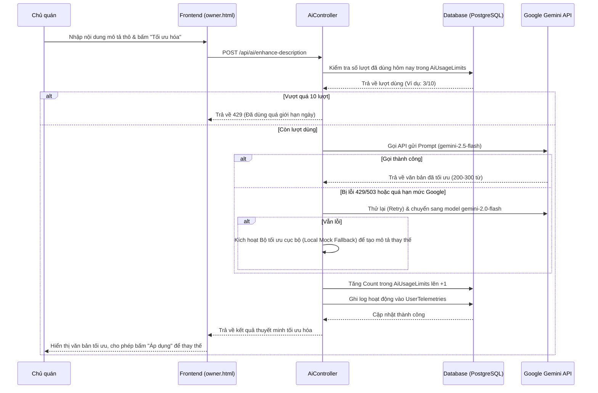
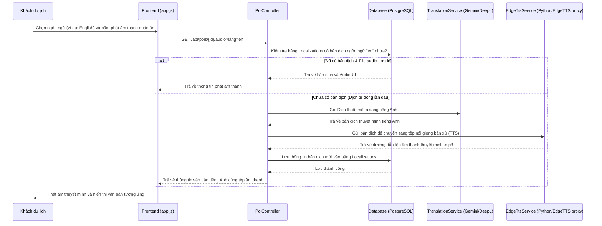

# Tài liệu Kiến trúc Hệ thống & Cơ sở Dữ liệu

Tài liệu này cung cấp cái nhìn chi tiết về thiết kế cơ sở dữ liệu (PostgreSQL), luồng dữ liệu, luồng sự kiện, và chức năng hoạt động của các module trong dự án Web App/PWA quản lý bản đồ ẩm thực đường phố Quận 4 (đường Vĩnh Khánh).

---

## 1. Cơ sở Dữ liệu (Database Schema)

Hệ thống sử dụng cơ sở dữ liệu **PostgreSQL** (Neon). Dưới đây là chi tiết tất cả các bảng, thuộc tính, mối quan hệ và cơ chế bảo mật dữ liệu.

### 1.1. Bảng `Users` (Người dùng)
Lưu trữ thông tin tài khoản người dùng, bao gồm khách du lịch công cộng, chủ quán ăn (Owner) và quản trị viên (Admin).
* **`Id`** (`Guid`, PK): Định danh duy nhất cho mỗi người dùng.
* **`DeviceUniqueId`** (`string`, Unique Index): Mã định danh thiết bị độc nhất của trình duyệt khách, dùng để tự động định danh và lưu lịch sử vị trí của khách du lịch mà không bắt buộc họ đăng nhập.
* **`Username`** (`string`): Tên đăng nhập (chỉ dành cho Chủ quán và Admin).
* **`PasswordHash`** (`string`): Mật khẩu đã được mã hóa một chiều bằng thuật toán PBKDF2 (SHA-256, 10,000 vòng lặp).
* **`PasswordSalt`** (`string`): Chuỗi muối ngẫu nhiên dùng trong quá trình băm mật khẩu.
* **`Role`** (`string`): Vai trò người dùng (`Public`, `Owner`, `Admin`). Mặc định là `Public`.
* **`IsVerified`** (`bool`): Trạng thái xác thực tài khoản chủ quán (chờ admin duyệt CCCD).
* **`IsPoiOwnerVerified`** (`bool`): Trạng thái xác thực thông tin quán ăn của chủ quán.
* **`LastActive`** (`DateTime`, UTC): Thời gian cuối cùng người dùng hoạt động (cập nhật qua GPS heartbeat 30 giây một lần).

### 1.2. Bảng `UserSessions` (Phiên đăng nhập)
Quản lý các mã Token đăng nhập tùy chỉnh (Custom Bearer Tokens) để bảo mật các API.
* **`Id`** (`Guid`, PK): Định danh phiên.
* **`UserId`** (`Guid`, FK -> `Users.Id`): ID người dùng sở hữu phiên này.
* **`Token`** (`string`): Chuỗi token ngẫu nhiên dạng Hex dài 64 ký tự.
* **`ExpiresAt`** (`DateTime`, UTC): Thời gian hết hạn của Token (mặc định sau 24 giờ kể từ lúc tạo).
* **`CreatedAt`** (`DateTime`, UTC): Thời gian tạo phiên.

### 1.3. Bảng `OwnerRegistrations` (Đăng ký Chủ quán)
Lưu đơn đăng ký làm chủ quán để Quản trị viên (Admin) xem xét và phê duyệt.
* **`Id`** (`Guid`, PK): Định danh đơn đăng ký.
* **`UserId`** (`Guid`, FK -> `Users.Id`): Tài khoản người dùng đăng ký.
* **`FullName`** (`string`): Họ và tên thật của chủ quán.
* **`CccdEncrypted`** (`string`): Số CCCD của chủ quán được **mã hóa bảo mật hai chiều bằng AES-256-CBC** nhằm bảo vệ dữ liệu cá nhân nhạy cảm (PII).
* **`Status`** (`string`): Trạng thái đơn duyệt (`Pending`, `Approved`, `Rejected`).
* **`CreatedAt`** (`DateTime`, UTC): Ngày gửi đơn đăng ký.
* **`AdminNote`** (`string`): Ghi chú phản hồi từ Admin (lý do từ chối hoặc lời nhắn).

### 1.4. Bảng `FoodStalls` (Quán ăn - POIs)
Lưu trữ thông tin định vị địa lý và nội dung giới thiệu của các quán ăn đường phố trên phố Vĩnh Khánh.
* **`Id`** (`Guid`, PK): Định danh quán ăn.
* **`Name`** (`string`): Tên quán ăn.
* **`Address`** (`string`): Địa chỉ quán ăn.
* **`Latitude`** (`double`): Vĩ độ tọa độ GPS.
* **`Longitude`** (`double`): Kinh độ tọa độ GPS.
* **`OriginalHistory`** (`string`): Mô tả thuyết minh gốc bằng tiếng Việt.
* **`OwnerId`** (`Guid?`, FK -> `Users.Id`, Nullable): ID của tài khoản chủ quán sở hữu. Nếu null, đây là quán ăn công cộng do hệ thống seed sẵn.
* **`IsVerified`** (`bool`): Trạng thái kiểm duyệt thông tin quán. Chỉ các quán có `IsVerified = true` mới hiển thị công khai trên bản đồ của khách du lịch.
* **`AdminNote`** (`string`): Ghi chú từ Admin khi phê duyệt hoặc từ chối sửa đổi thông tin quán.

### 1.5. Bảng `Localizations` (Bản dịch & Tệp âm thanh)
Lưu trữ bản dịch mô tả quán ăn sang các ngôn ngữ khác và liên kết âm thanh Text-To-Speech đã được tạo trước để phát offline.
* **`Id`** (`Guid`, PK): Định danh bản dịch.
* **`FoodStallId`** (`Guid`, FK -> `FoodStalls.Id`): ID quán ăn tương ứng.
* **`LanguageCode`** (`string`): Mã ngôn ngữ (`en`, `ja`, `ko`, `zh`, `fr`, ...).
* **`TranslatedText`** (`string`): Nội dung mô tả đã được dịch sang ngôn ngữ đích.
* **`TextHash`** (`string`): Mã băm MD5 của nội dung thuyết minh gốc nhằm theo dõi thay đổi. Nếu thuyết minh gốc thay đổi, mã băm sẽ khác đi và hệ thống tự động dịch/tạo lại file nói mới.
* **`AudioUrl`** (`string`): Đường dẫn tệp âm thanh thuyết minh `.mp3` được lưu trữ để phát âm thanh.

### 1.6. Bảng `UserTelemetries` (Lịch sử hoạt động & Vị trí)
Lưu trữ thông tin hoạt động thời gian thực và lịch sử tọa độ của du khách và chủ quán để phục vụ bản đồ Live Tracking của Admin.
* **`Id`** (`Guid`, PK): Định danh.
* **`UserId`** (`Guid`, FK -> `Users.Id`): Người dùng thực hiện hoạt động.
* **`Timestamp`** (`DateTime`, UTC): Thời điểm ghi nhận hoạt động.
* **`Latitude`** (`double`): Vĩ độ hiện tại của người dùng.
* **`Longitude`** (`double`): Kinh độ hiện tại của người dùng.
* **`Action`** (`string`): Hoạt động thực hiện (Ví dụ: `HEARTBEAT` (GPS 30s), `LISTENED_STALL` (nghe thuyết minh), `CHAT_AI` (hỏi AI)).

### 1.7. Bảng `AiUsageLimits` (Hạn mức sử dụng AI)
Giám sát số lượng cuộc gọi AI hằng ngày để ngăn chặn lạm dụng tài nguyên (giới hạn 10 lượt/ngày cho mỗi chủ quán).
* **`Id`** (`Guid`, PK): Định danh.
* **`UserId`** (`Guid`, FK -> `Users.Id`): Chủ quán sử dụng AI.
* **`Date`** (`DateTime`, UTC): Ngày ghi nhận sử dụng (được đặt chuẩn UTC Date).
* **`Count`** (`int`): Số lượt đã sử dụng trong ngày.

### 1.8. Bảng `Notifications` (Thông báo)
Hệ thống thông báo đẩy trực tiếp cho chủ quán khi có phê duyệt/từ chối từ quản trị viên.
* **`Id`** (`Guid`, PK): Định danh thông báo.
* **`UserId`** (`Guid`, FK -> `Users.Id`): Chủ quán nhận thông báo.
* **`Message`** (`string`): Nội dung thông báo (Ví dụ: "Đơn đăng ký chủ quán của bạn đã được phê duyệt!").
* **`IsRead`** (`bool`): Trạng thái đã đọc (`true`/`false`). Mặc định là `false`.
* **`CreatedAt`** (`DateTime`, UTC): Thời gian tạo thông báo.

---

## 2. Luồng Sự kiện & Luồng Dữ liệu (Event & Data Flows)

### 2.1. Luồng Đăng ký & Đăng nhập phân quyền

### 2.2. Luồng Phê duyệt Đơn đăng ký Chủ quán (CCCD)

### 2.3. Luồng Định vị và Live Tracking (GPS Heartbeat Loop)

### 2.4. Luồng Tối ưu hóa Thuyết minh (AI Advisor)

### 2.5. Luồng Đa ngôn ngữ (Translation & Text-To-Speech)

---

## 3. Mô tả các Module chính (Module Descriptions)

Hệ thống được chia thành 2 phần chính: **Backend** (ASP.NET Core / C#) và **Frontend** (HTML5, Vanilla CSS, Vanilla Javascript).

### 3.1. Backend Module (Controllers & Services)

#### A. Controllers (Bộ điều hướng API)
* **`AuthController.cs`**:
  * *Chức năng:* Xử lý đăng ký, đăng nhập tài khoản. Hỗ trợ đăng ký tài khoản chủ quán đặc thù (yêu cầu điền CCCD, tên quán, tọa độ vĩ độ/kinh độ).
  * *Cách thực hiện:* Sử dụng cơ chế băm mật khẩu `EncryptionHelper.HashPassword` để bảo mật. Sau khi đăng nhập thành công, tạo một token phiên lưu trữ trong bảng `UserSessions` có thời hạn để xác thực các request kế tiếp qua header `Authorization: Bearer <token>`.
* **`AdminController.cs`**:
  * *Chức năng:* Cung cấp API dành riêng cho quản trị viên bao gồm:
    * Thống kê tổng số lượng quán ăn, người dùng, số người đang online (hoạt động trong 5 phút qua).
    * Lấy danh sách tọa độ thời gian thực của người dùng đang trực tuyến (`GET /api/admin/live-users`).
    * Duyệt/từ chối tài khoản chủ quán mới (`CCCD` được giải mã tự động bằng AES-256 để hiển thị cho Admin thẩm định).
    * Duyệt/từ chối các chỉnh sửa hoặc thêm mới quán ăn (`FoodStalls`).
    * Xem toàn bộ nhật ký hệ thống (`UserTelemetries`).
* **`OwnerController.cs`**:
  * *Chức năng:* Cung cấp API cho chủ quán cập nhật thông tin quán ăn của mình (đổi tên, địa chỉ, kéo thả tọa độ mới, cập nhật mô tả thuyết minh) và lấy danh sách thông báo từ Admin.
* **`AiController.cs`**:
  * *Chức năng:* Xử lý yêu cầu tối ưu mô tả thuyết minh của chủ quán bằng trí tuệ nhân tạo.
  * *Cách thực hiện:* Thực hiện kiểm tra rate-limit tối đa 10 lượt/ngày. Gọi trực tiếp API của Google Gemini. Có sẵn cơ chế tự động thử lại (Retry) và chuyển đổi dự phòng sang model Gemini khác hoặc kích hoạt thuật toán tối ưu hóa cục bộ (Local Mock) để đảm bảo không bao giờ ném lỗi 500 khi API của Google bị nghẽn mạng hay hết hạn mức.
* **`ChatController.cs`**:
  * *Chức năng:* Trợ lý Tour du lịch ẩm thực ảo (AI Food Tour Guide) trả lời thắc mắc của du khách về các quán ăn.
  * *Cách thực hiện:* Nạp toàn bộ dữ liệu quán ăn trên đường Vĩnh Khánh làm ngữ cảnh (Context RAG), ghép nối với câu hỏi của người dùng và gửi tới API Gemini để tạo ra phản hồi thông minh, đề xuất lộ trình đi bộ ăn uống hợp lý.
* **`PoiController.cs`**:
  * *Chức năng:* Quản lý thông tin quán ăn cho người dùng công cộng, cung cấp API phát âm thanh thuyết minh đa ngôn ngữ.

#### B. Services (Dịch vụ Tiện ích)
* **`EncryptionHelper.cs`**:
  * *Chức năng:* Mã hóa bảo mật.
  * *Cách thực hiện:*
    * Mã hóa một chiều mật khẩu bằng PBKDF2 với muối ngẫu nhiên (128-bit muối, 256-bit mã băm, 10,000 vòng lặp).
    * Mã hóa bảo mật hai chiều số CCCD bằng thuật toán **AES-256-CBC** sử dụng một khóa bí mật cố định (Secret Key) để bảo vệ PII của chủ quán trước các đợt rò rỉ dữ liệu.
* **`TranslationService.cs`**:
  * *Chức năng:* Dịch tự động thuyết minh sang các ngôn ngữ khác (Anh, Nhật, Hàn, Pháp, Trung).
  * *Cách thực hiện:* Gọi API Google Gemini / DeepL với cấu hình thử lại tự động và trả về văn bản dịch gốc.
* **`EdgeTtsService.cs`**:
  * *Chức năng:* Chuyển đổi văn bản thuyết minh đã dịch thành giọng nói chuẩn bản xứ chất lượng cao (TTS).
  * *Cách thực hiện:* Gọi qua một máy chủ proxy nhỏ chạy Python thực hiện thư viện `edge-tts` của Microsoft, tải xuống tệp âm thanh `.mp3` và lưu trữ cục bộ để phục vụ phát âm thanh offline.
* **`AudioGenerationPipeline.cs`**:
  * *Chức năng:* Chuỗi xử lý tự động đồng bộ hóa. Khi thuyết minh gốc tiếng Việt thay đổi, Pipeline sẽ tự động kích hoạt dịch sang tất cả các ngôn ngữ đích, sau đó tạo lại toàn bộ file âm thanh thuyết minh mới tương ứng.

### 3.2. Frontend Module (Giao diện PWA)

* **Trang chủ (`index.html` / `app.js` / `sw.js`)**:
  * *Chức năng:* Dành cho khách du lịch đi bộ khám phá ẩm thực.
  * *Cách thực hiện:*
    * Hiển thị bản đồ Leaflet trực quan chứa các quán ăn đường phố.
    * Tự động lấy vị trí hiện tại bằng GPS của trình duyệt (hoặc GPS Giả lập - GPS Mocking/Path Walking đi bộ mô phỏng để lập trình viên dễ dàng chạy thử nghiệm mà không cần di chuyển ngoài đường).
    * Khi du khách tiến lại gần quán ăn (bán kính < 15-20 mét), PWA tự động kích hoạt phát âm thanh thuyết minh giới thiệu bằng ngôn ngữ du khách đã chọn (Tiếng Việt, Anh, Nhật, Hàn,...).
    * Tích hợp khung Chat AI Tour Guide góc dưới màn hình để hỏi đáp địa điểm ăn uống.
    * Hỗ trợ cài đặt thành ứng dụng di động (PWA) có khả năng chạy ngoại tuyến thông qua Service Worker (`sw.js`).
* **Trang chủ quán (`owner.html` / `owner.js`)**:
  * *Chức năng:* Dành cho chủ quán ăn quản lý cửa hàng của mình.
  * *Cách thực hiện:*
    * Cho phép chỉnh sửa thông tin quán ăn, kéo thả ghim trên bản đồ Leaflet để định vị tọa độ chính xác của quán ăn di động.
    * Tích hợp trợ lý AI Advisor giúp tối ưu mô tả thô của quán thành văn bản giới thiệu sinh động, thu hút khách du lịch.
    * Nhận thông báo thời gian thực về việc phê duyệt quán từ admin (thông qua biểu tượng chuông thông báo).
* **Trang quản trị (`admin.html` / `admin.js`)**:
  * *Chức năng:* Giám sát và vận hành hệ thống.
  * *Cách thực hiện:*
    * Dashboard hiển thị các thẻ chỉ số trực quan (Tổng số quán, số người dùng, số người đang online).
    * Bản đồ Leaflet giám sát thời gian thực vị trí di chuyển của tất cả người dùng hoạt động trên tuyến đường Vĩnh Khánh (Live User Tracking).
    * Các bảng phê duyệt đăng ký chủ quán (có chức năng hiển thị số CCCD đã được giải mã tự động) và duyệt thuyết minh quán ăn mới cập nhật.
    * Bảng kiểm tra nhật ký hoạt động hệ thống (System Audit Telemetry Logs).
* **Trang đăng nhập / Đăng ký chủ quán (`login.html` / `register-owner.html`)**:
  * Giao diện nhập thông tin đăng nhập và đăng ký định danh an toàn có kèm bản đồ chọn vị trí quán ăn trực quan.
