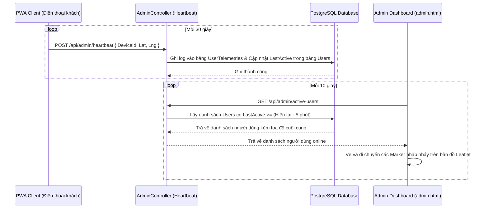
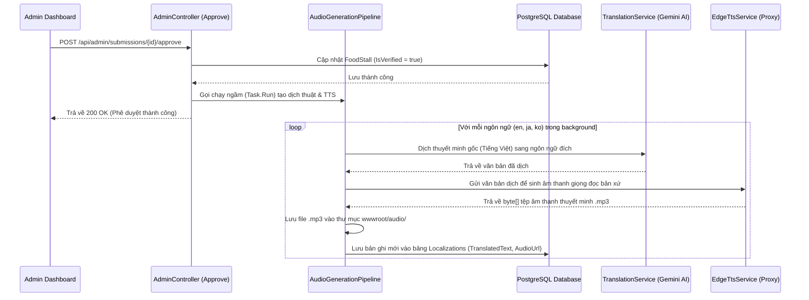
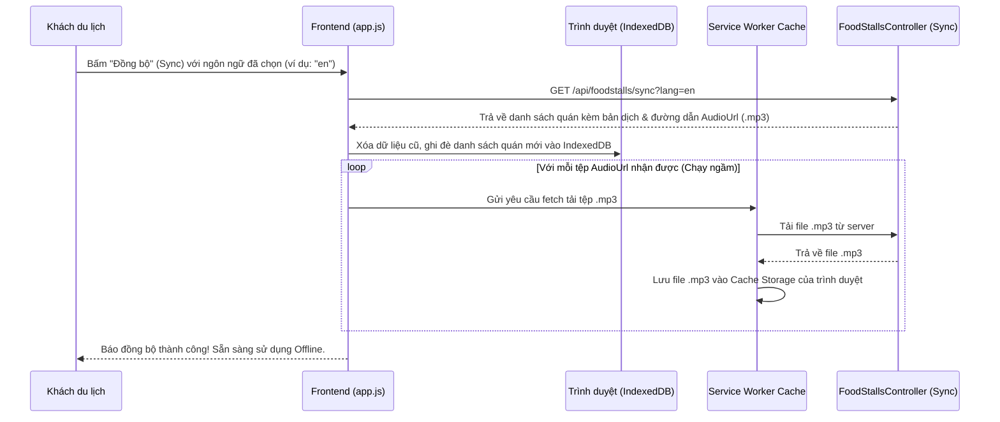

# Miêu Tả Chi Tiết Dự Án: Vĩnh Khánh Street Food Map & PWA Tour Guide

Dự án này là một hệ thống bản đồ số và trợ lý hướng dẫn du lịch ẩm thực đường phố tại phố Vĩnh Khánh, Quận 4, TP.HCM. Ứng dụng hoạt động theo cơ chế **Offline-First (PWA)** giúp du khách nghe thuyết minh tự động khi đi bộ, kết hợp cổng quản lý cho chủ quán và trang giám sát trực tuyến thời gian thực dành cho Admin.

---

## 1. Bản Đồ Chức Năng Hệ Thống (Functional Specifications)

Hệ thống được chia làm 3 phân hệ giao diện chính tương ứng với 3 đối tượng người dùng (Actors):

### 1.1. Phân hệ Khách Du Lịch (PWA Client)
Dành cho khách du lịch đi bộ khám phá ẩm thực, được tối ưu hóa giao diện di động chạy mượt mà ngay cả khi không có kết nối mạng:
* **Bản đồ ẩm thực tương tác:** Sử dụng bản đồ Leaflet.js hiển thị vị trí các quán ăn đường phố bằng ghim màu cam nổi bật.
* **Định vị GPS & GPS Giả lập (GPS Mocking):**
  * Định vị vị trí hiện tại của du khách trên bản đồ (hiển thị chấm xanh radar).
  * **Mô phỏng đi bộ (Simulate Walk):** Tự động điều khiển vị trí của du khách di chuyển dọc tuyến đường Vĩnh Khánh qua các tọa độ định sẵn để phục vụ việc kiểm thử các tính năng mà không cần ra ngoài đường.
  * **Giả lập chạm bản đồ:** Cho phép click vào bất kỳ vị trí nào trên bản đồ để nhảy tọa độ người dùng đến điểm đó.
* **Tự động phát thuyết minh đa ngôn ngữ:** Khi du khách đi vào bán kính $\le 20\text{m}$ của một quán ăn, ứng dụng tự phát bài nói giới thiệu về quán ăn bằng ngôn ngữ đã chọn (Việt, Anh, Nhật, Hàn).
* **Đồng bộ offline (Sync Offline):** Nút **Đồng bộ** giúp tải toàn bộ thông tin quán ăn lưu vào IndexedDB nội bộ và tự động tải trước (prefetch) các file âm thanh `.mp3` lưu vào bộ nhớ cache của Service Worker.
* **Trợ lý du lịch ảo (Chat AI Tour Guide):** Trò chuyện hỏi đáp về món ăn, địa chỉ, hoặc yêu cầu lên lịch trình đi bộ ăn uống dựa trên ngữ cảnh (Context RAG) của toàn bộ các quán ăn.

### 1.2. Phân hệ Chủ Quán Ăn (Owner Portal)
Dành cho các chủ hộ kinh doanh quán ăn tự quản lý thông tin cửa hàng di động của mình:
* **Đăng ký tài khoản (Mã hóa CCCD):** Đăng ký tài khoản, ghim vị trí ban đầu của quán ăn trên bản đồ. Số CCCD được tự động mã hóa bảo mật hai chiều bằng thuật toán **AES-256-CBC** để tránh lộ thông tin cá nhân.
* **Đăng nhập phân quyền:** Xác thực tài khoản bằng mật khẩu băm bảo mật (PBKDF2) và lưu token Bearer để cấp quyền cho phiên hoạt động.
* **Cập nhật tọa độ di động & Thuyết minh quán:** 
  * Cho phép ghim lại vị trí mới của quán ăn bằng bản đồ Leaflet kéo thả (thích hợp cho xe đẩy, quán ăn di động).
  * Cập nhật mô tả thuyết minh của quán. Khi bấm lưu, quán ăn sẽ tạm thời ẩn khỏi bản đồ công cộng (`IsVerified = false`) chờ Admin phê duyệt nội dung.
* **AI Advisor tối ưu thuyết minh:** Gọi Gemini AI để tự động viết lại bài giới thiệu thô của chủ quán thành bài viết chuyên nghiệp, hấp dẫn dài 200-300 từ (giới hạn 10 lượt gọi/ngày).
* **Hộp thư thông báo:** Nhận thông báo thời gian thực về kết quả kiểm duyệt của Admin (Duyệt/Từ chối kèm lý do phản hồi).

### 1.3. Phân hệ Quản Trị Viên (Admin Portal)
Dành cho quản trị viên tối cao vận hành, giám sát hoạt động hệ thống:
* **Dashboard thống kê:** Xem các số liệu tổng quan (Tổng số quán, số người dùng đã đăng ký, số du khách đang hoạt động trực tuyến).
* **Giám sát trực tuyến (Live User Tracking):** Bản đồ động hiển thị ghim xanh radar di chuyển liên tục, đại diện cho vị trí thực tế của tất cả người dùng đang online (dựa vào sóng heartbeat 30 giây gửi từ client).
* **Phê duyệt đơn đăng ký chủ quán:** Duyệt đơn của chủ quán mới. Số CCCD được tự động giải mã từ database để hiển thị cho Admin kiểm tra đối chiếu.
* **Phê duyệt thuyết minh:** Xem nội dung thuyết minh mới của quán ăn, phê duyệt để đưa quán hoạt động công khai trở lại trên bản đồ. Phê duyệt thành công sẽ tự động kích hoạt luồng dịch và sinh âm thanh Edge-TTS chạy ngầm.
* **Nhật ký hệ thống (Audit Logs):** Xem bảng 100 hoạt động gần nhất của hệ thống (ai làm gì, thời gian nào, tọa độ ở đâu).

---

## 2. Các Luồng Xử Lý Dữ Liệu Chính (Data Pipelines)

Hệ thống vận hành thông qua 3 luồng dữ liệu cốt lõi hoạt động độc lập và bất đồng bộ:

### 2.1. Luồng Giám Sát Vị Trí Trực Tuyến (GPS Telemetry Pipeline)
Luồng này liên tục truyền và biểu diễn dữ liệu vị trí thời gian thực giữa Khách du lịch và trang Admin:

### 2.2. Luồng Tự Động Hóa Dịch Thuật & Phát Thanh (Translation & TTS Pipeline)
Khi Admin phê duyệt một quán ăn, hệ thống sẽ kích hoạt chuỗi xử lý nền để tạo gói đa ngôn ngữ phục vụ nghe offline:

### 2.3. Luồng Đồng Bộ & Đệm Ngoại Tuyến (Offline Sync & Prefetch Pipeline)
Giúp ứng dụng PWA có đầy đủ dữ liệu để chạy hoàn toàn offline khi du khách đi vào các vùng sóng yếu hoặc mất mạng:

---

## 3. Các Cơ Chế Bảo Mật & Chống Lỗi (Security & Resilience)

### 3.1. Bảo mật Dữ liệu (Cryptography)
* **Băm mật khẩu (PBKDF2):** Mật khẩu chủ quán và admin được băm một chiều bằng PBKDF2 với chuỗi muối (Salt) ngẫu nhiên 128-bit, tạo ra khóa băm 256-bit qua 10,000 vòng lặp, ngăn chặn tấn công vét cạn (brute-force).
* **Mã hóa CCCD hai chiều (AES-256-CBC):** Số CCCD của chủ quán (dữ liệu nhạy cảm PII) được mã hóa bằng thuật toán đối xứng AES-256 kết hợp vector khởi tạo (IV) ngẫu nhiên trước khi lưu vào database. Số CCCD này chỉ được giải mã tạm thời trên bộ nhớ RAM khi Admin mở tab phê duyệt để đối chiếu thông tin.

### 3.2. Chống lỗi và dự phòng API AI (Gemini Resilience)
Để tránh gián đoạn tính năng khi API Google Gemini bị quá tải hoặc hết hạn mức (lỗi 429/503), hệ thống áp dụng cơ chế tự động phục hồi:
1. **Thử lại tự động (Retry with Backoff):** Tự động gửi lại yêu cầu tối đa 3 lần với thời gian chờ tăng gấp đôi (1s, 2s, 4s).
2. **Dự phòng Model (Model Fallback):** Nếu model `gemini-2.5-flash` lỗi hoặc quá tải, hệ thống tự động đổi sang gọi model `gemini-2.0-flash`.
3. **Bộ tối ưu hóa thuyết minh cục bộ (Local Mock Fallback):** Nếu toàn bộ API Google lỗi, hệ thống tự động gọi hàm sinh văn bản mẫu nội bộ, kết hợp thông tin thô của chủ quán với các từ ngữ ẩm thực mô tả sinh động để tạo thành bài giới thiệu đạt chuẩn 200-300 từ. Chủ quán vẫn nhận được kết quả tối ưu để lưu bài mà không gặp bất kỳ lỗi crash nào.
